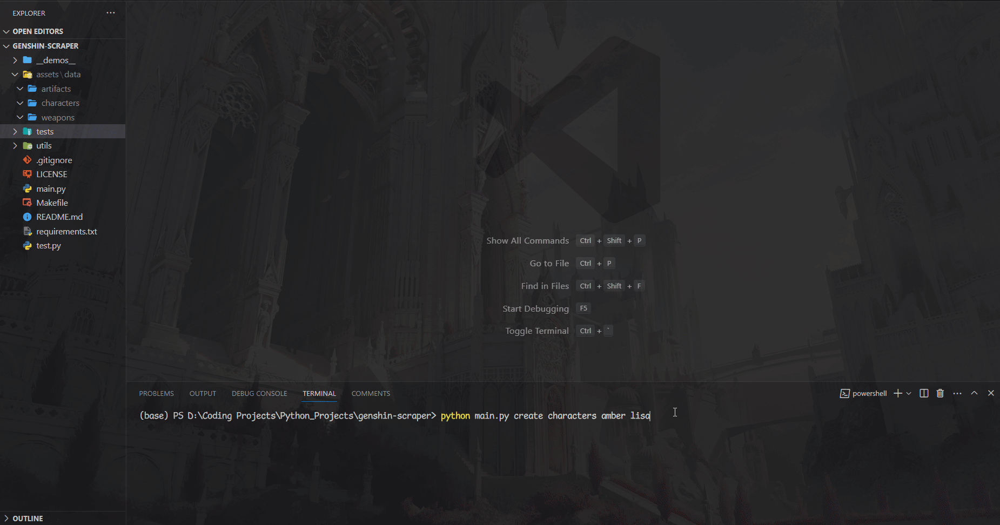
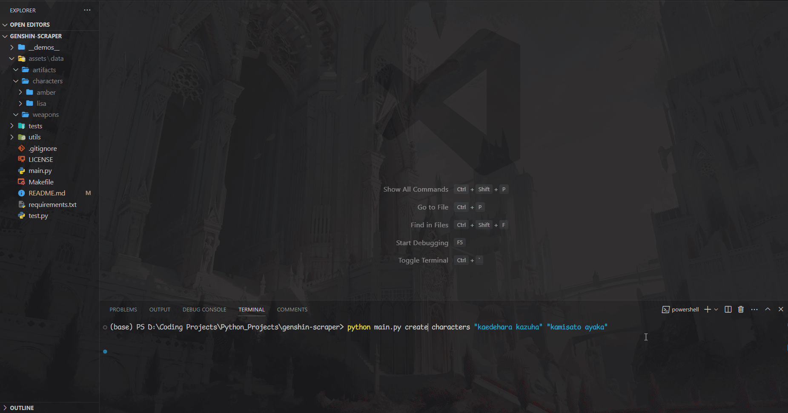

# GENSHIN SCRAPER
## Description
This is a scraper for data on things from the game "Genshin Impact". Data is scraped from [Fandom](https://genshin-impact.fandom.com/wiki/Genshin_Impact_Wiki), processed, and stored in JSON files. My intent is to add this data to the [genshin.dev API](https://github.com/genshindev/api) project.

## Prerequisites
- [Python](https://www.python.org/downloads/) ^3.11.0
- [Pipenv](https://pypi.org/project/pipenv/) (optional)
- [Make](https://www.gnu.org/software/make/) (optional)

## Dependencies
- [BeautifulSoup4](https://pypi.org/project/beautifulsoup4/)
- [Requests](https://pypi.org/project/requests/)
- [Colorama](https://pypi.org/project/colorama/) (for coloured terminal output)
- [cChardet](https://pypi.org/project/cchardet/)
- [lxml](https://pypi.org/project/lxml/)

## Usage
```bash
$ python3 main.py "function" "category" "args[]"
```

```bash
$ pipenv run dev "function" "category" "args[]"
```

```bash
$ make "function" "category" "args[]"
```

> The `function` argument specifies which function to run:
> - `create`: generates data
> - `clear`: clears data in directories
> - `list`: lists categories or their items
> 
> The `category` argument specifies the category of items.

Adding `args[]` is optional. If no `args[]` are provided, the program will scrape all items of the given category. If `args[]` are provided, the program will scrape only the items specified by the `args[]`. The `args[]` are the names of the items, separated by spaces.

Example use for scraping the characters `"Amber"` and `"Lisa"`, run the following command:

```bash
$ python3 main.py create characters amber lisa
```


```bash
$ pipenv run dev create characters amber lisa
```

```bash
$ make create characters amber lisa
```


For characters with multi-word names, wrap their name around quotations (Python) or use hyphens (Make). For example, to scrape `"Kaedehara Kazuha"` and `"Kamisato Ayaka"`, run the following command:

```bash
$ python3 main.py create characters "kaedehara kazuha" "kamisato ayaka"
```


```bash
$ pipenv run dev create characters "kaedehara kazuha" "kamisato ayaka"
```

```bash
$ make create characters kaedehara-kazuha kamisato-ayaka
```


To clear the data of a category, change the `create` command to `clear`. For example, to clear the data of all characters, run the following command:

```bash
$ python3 main.py clear characters
```

```bash
$ pipenv run dev clear characters
```

```bash
$ make clear characters
```

## License
Licensed under Open Software License v3.0
